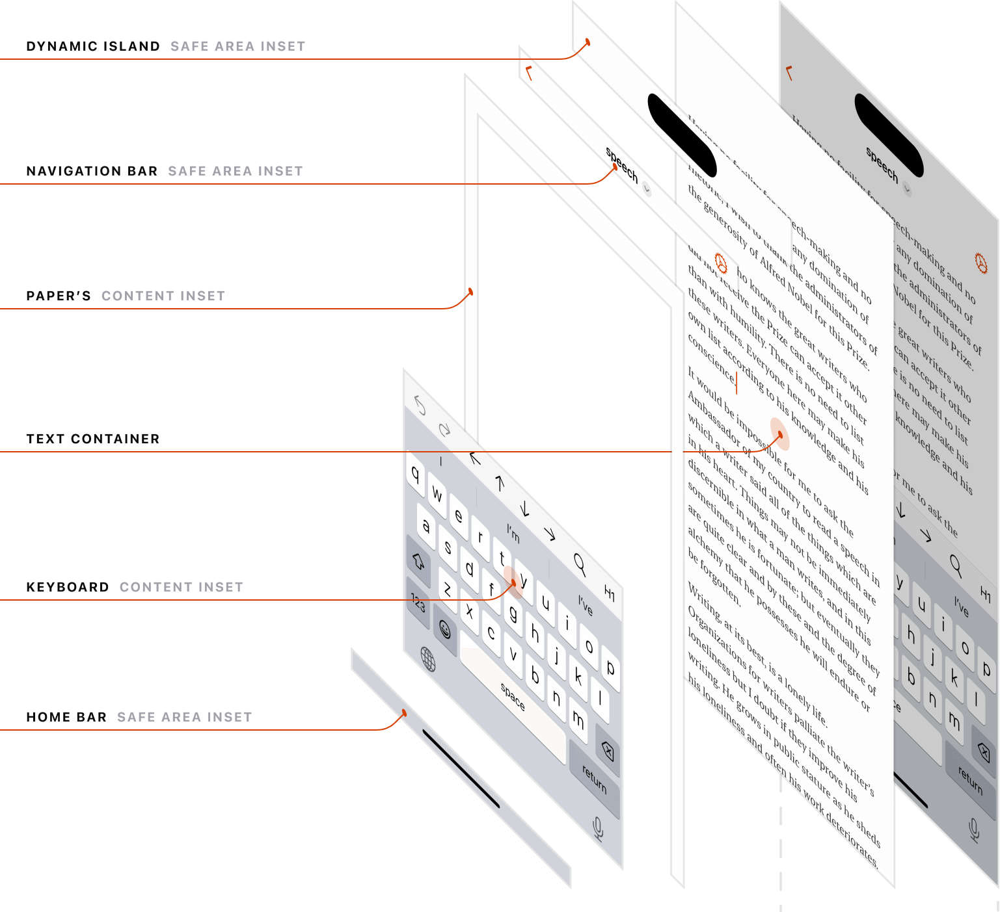
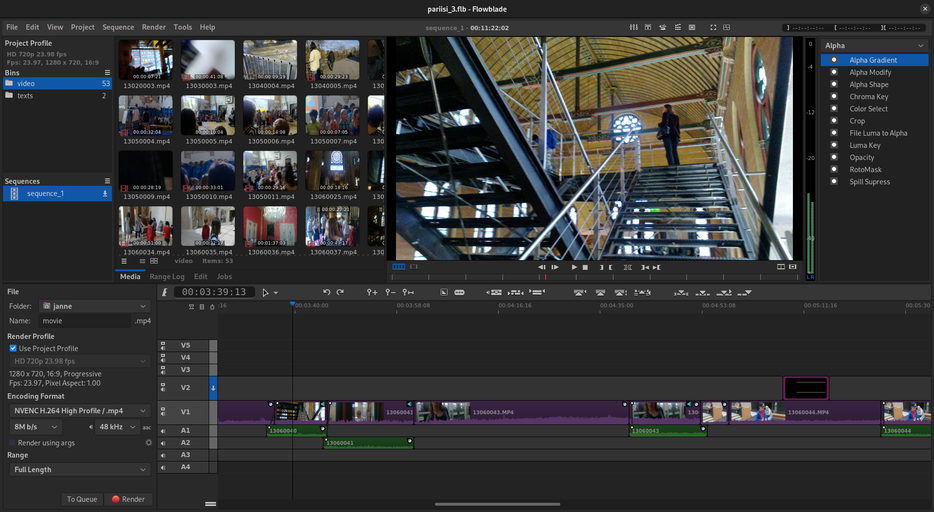
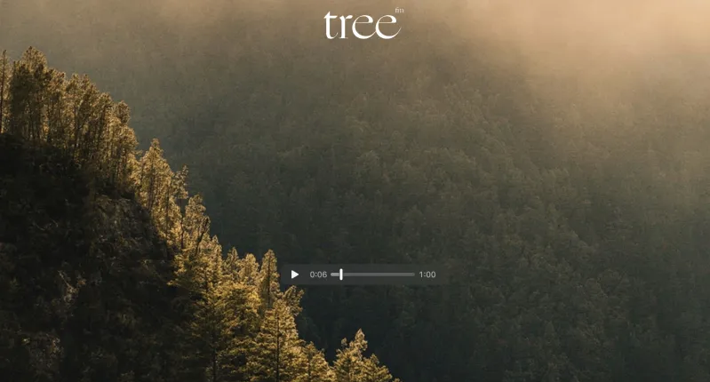

### [Loading Dynamic Libraries on Mac](http://clarkkromenaker.com/post/library-dynamic-loading-mac/)
`clarekromenaker.com`

> "... I was recently learning how Mac and Linux machines load dynamic libraries, so I thought I’d write a quick post about it. ..."

[Stellarium](https://stellarium.org/en/) "... Stellarium is a free open source planetarium for your computer. It shows a realistic sky in 3D, just like what you see with the naked eye, binoculars or a telescope. ..."

[9 years of Apple text editor solo dev](https://papereditor.app/dev?ref=labnotes.org) it's awesome to see such attention to details, resulting in a beautiful user interface - "... I’ve built a tiny iOS app once. That was about the extent of my proximity to the world of Apple dev at the time ..."

### [Building a fully local LLM voice assistant to control my smart home](https://johnthenerd.com/blog/local-llm-assistant/)
`johnthenerd.com`

> "... I’ve had my days with Siri and Google Assistant. While they have the ability to control your devices, they cannot be customized and inherently rely on cloud services. ..."

### [Fish: Start ssh-agent on session opening on MacOS](https://dev.to/gauthierplm/fish-start-ssh-agent-on-session-opening-on-macos-2884)
`dev.to/gauthierplm`

> "... One of the thing I missed however was a proper setup of my ssh agent on session opening. ..."

[maybe](https://github.com/maybe-finance/maybe) "... This is the original React app of the previously-defunct personal finance app, Maybe. This original version used many external services (Plaid, Finicity, Auth0, etc) and getting it to fully function will be a decent amount of work ..."

[LibreChat](https://github.com/danny-avila/LibreChat) "... LibreChat brings together the future of assistant AIs with the revolutionary technology of OpenAI's ChatGPT. ..."

[Flowblade](https://jliljebl.github.io/flowblade/) "... Flowblade is a multitrack non-linear video editor for Linux released under GPL 3 license. Flowblade is designed to provide a fast, precise and as-simple-as-possible editing experience. ..."

[Tree.fm](https://www.tree.fm/) "... Tree.fm is a website that plays the sounds of forests from around the world. ..."

### [srikanth235/privy: Your private coding assistant](https://github.com/srikanth235/privy)
`github.com/srikanth235`

> "... A privacy-first coding assistant. ..."
