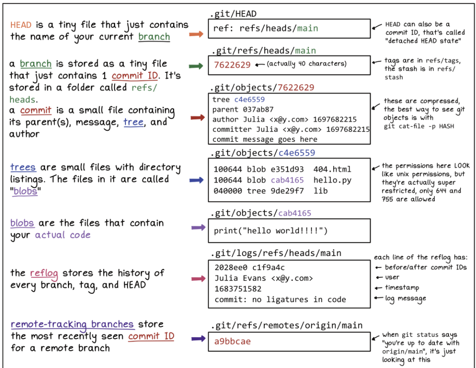

[Inside .git](https://jvns.ca/blog/2024/01/26/inside-git/) - "... It’s a ~15 word explanation of each part of your .git directory ..."

[Ubicloud](https://www.ubicloud.com/use-cases/github-actions) - "... Ubicloud is a cloud platform that provides a 10x cheaper alternative to GitHub Actions. ..."

[Portable EPUBs](https://willcrichton.net/notes/portable-epubs/) - "... This post explores what prevents HTML documents from being portable, and I propose a way forward based on the EPUB format. ..."

[Talon](https://talonvoice.com/docs/) - "... Talon is a tool for hands-free computing. It enables you to control your computer with your voice. ..."

[Cursorless](https://www.cursorless.org/) - "... Cursorless is a voice coding tool that lets you write code at the speed of thought. ..."

[marker](https://github.com/VikParuchuri/marker) - "... Convert PDF to markdown quickly with high accuracy ..."

[Watch Our Planet](https://www.openculture.com/2024/02/free-watch-our-planet-a-groundbreaking-nature-documentary-series-narrated-by-david-attenborough.html) - "... a Groundbreaking Nature Documentary Series Narrated by David Attenborough  ..."

[unstructured](https://github.com/Unstructured-IO/unstructured) - "... : Open source libraries and APIs to build custom preprocessing pipelines for labeling, training, or production machine learning pipelines. ..."
