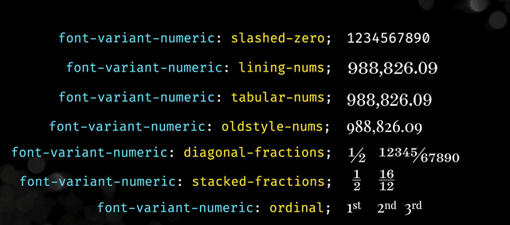

[golte](https://github.com/nichady/golte) - "... Render Svelte components in your Go http handlers. ..."

[File over app](https://stephango.com/file-over-app) - "... File over app is an appeal to tool makers: accept that all software is ephemeral, and give people ownership over their data ..."

[Using Font Variant Numeric](https://textlab.dev/posts/font-variant-numeric?ref=labnotes.org) - "... The font-variant-numeric CSS property allows us to control alternate glyphs for numbers, fractions, and ordinal markers ..."

[ollama-webui](https://github.com/ollama-webui/ollama-webui) - "... ChatGPT-Style Web UI Client for Ollama 🦙 ..."

[Multimodal Ollama Cookbook](https://docs.llamaindex.ai/en/latest/examples/multi_modal/ollama_cookbook.html#) - "... This cookbook shows how you can build different multimodal RAG use cases with LLaVa on Ollama. ..."

[Expensify/App](https://github.com/Expensify/App) - "... a complete re-imagination of financial collaboration, centered around chat. Help us build the next generation of Expensify by sharing feedback and contributing to the code ..."

[tokamak](https://github.com/cztomsik/tokamak) - "... Server-side framework for Zig, relying heavily on dependency injection. ..."

[Simple Precision Time Protocol at Meta](https://engineering.fb.com/2024/02/07/production-engineering/simple-precision-time-protocol-sptp-meta/) - "... While deploying Precision Time Protocol (PTP) at Meta, we’ve developed a simplified version of the protocol (Simple Precision Time Protocol – SPTP) ..."

[Fast Car](https://www.openculture.com/2024/02/how-an-unscheduled-last-minute-performance-of-fast-car-shot-tracy-chapman-to-stardom-in-1988.html) - "... How an Unscheduled, Last Minute Performance of "Fast Car" Shot Tracy Chapman to Stardom in 1988 ..."

[How I write HTTP services in Go after 13 years | Grafana Labs](https://grafana.com/blog/2024/02/09/how-i-write-http-services-in-go-after-13-years/) "... That original post went a little viral and sparked some great discussions that have influenced how I do things today. ..."
