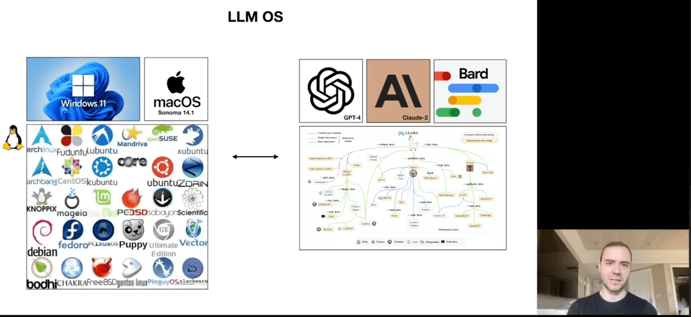

### [Fly over the 2024 total solar eclipse](https://www.greatamericaneclipse.com)
`greatamericaneclipse.com`

> " ... This animation of the Moon’s shadow across North America simulates the view from a spacecraft 125 miles high chasing the shadow! ..."

### [Noiselith](https://noiselith.com)
`noiselith.com`

> " ... The power of Stable Diffusion XL in your device, offline ..."

### [React Server Components](https://jessedit.tech/blog/react-server-components)
`jessedit.tech`

> " ... React Server Components have been around for almost three years now. But, it seems like many people don't fully understand how they work or the problems they solve ..."

### [The Mind Behind Windows: Dave Cutler](https://www.youtube.com/watch?v=xi1Lq79mLeE)
`youtube.com/Dave's Garage`

> "... Dave Cutler, the designer and architect of Windows, RSX11m, and VMS ..."

this is a legendary guy, nice to hear him talk about his work

### [MLX: an array framework for Apple Silicon](https://twitter.com/awnihannun/status/1732184443451019431?s=61&t=QrohFj15-adAvv3Nuh7KYg)
`twitter.com/awnihannun`

> "... MLX is an efficient machine learning framework specifically designed for Apple silicon (i.e. your laptop!) ..."

### [Intro to Large Language Models](https://www.youtube.com/watch?v=zjkBMFhNj_g)
`Andrej Karpathy`

> "... This is a 1 hour general-audience introduction to Large Language Models: the core technical component behind systems like ChatGPT, Claude, and Bard. What they are, where they are headed, ..."

