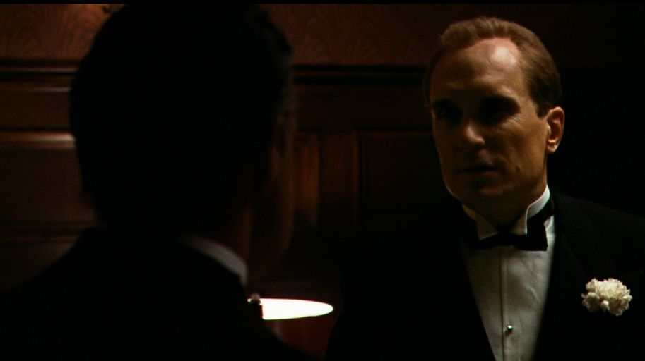

in memory of robert duvall

`who should i give this job to ?`

[Big Tech vs. OpenClaw](https://www.jakequist.com/thoughts/big-tech-vs-openclaw/?ref=labnotes.org)

> OpenClaw launched last week. If you haven’t tried it yet, it’s essentially a way for AI to control your computer on your behalf.

[A Software Library with No Code](https://www.dbreunig.com/2026/01/08/a-software-library-with-no-code.html)

> All You Need is Specs?

[I have a new favorite coding font](https://fantinel.dev/blog/maple-mono-font)

> Last week I came across a post on Mastodon mentioning [Maple Mono](https://font.subf.dev/en/), a monospaced font

[koala73/worldmonitor: Real-time global intelligence dashboard](https://github.com/koala73/worldmonitor)

> AI-powered news aggregation, geopolitical monitoring, and infrastructure tracking in a unified situational awareness interface

