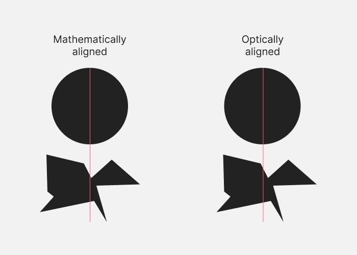

[Visual design rules you can safely follow every time](https://anthonyhobday.com/sideprojects/saferules/)

**Some nice design tips you can apply to your projects.**

[React Native Security Guide | Oscar Franco](https://ospfranco.com/react-native-security-guide/)
> Let’s address this upfront: there is no real way to protect data once it is on the device

[The Forensics Of React Server Components (RSCs)](https://www.smashingmagazine.com/2024/05/forensics-react-server-components/)
> ... examines how we got here with a deep look at the impact that RSCs have on the page load timeline

[Your API Shouldn't Redirect HTTP to HTTPS](https://jviide.iki.fi/http-redirects?ref=labnotes.org)
> ... the common practice of redirecting API calls from HTTP to HTTPS should be reconsidered. While the post mostly refers to REST APIs ...

[Sneaky React Memory Leaks II](https://schiener.io/2024-05-29/react-query-leaks)
> Closures Vs. React Query

[Resurfacing the past](https://storymaps.arcgis.com/stories/41d4bd6029044afbb1b9ad805a4731d8)
> More than 20,000 ships sank during World War II. One man is on a mission to map them all

[jordanbaird/Ice](https://github.com/jordanbaird/Ice)
> Powerful menu bar manager for macOS
