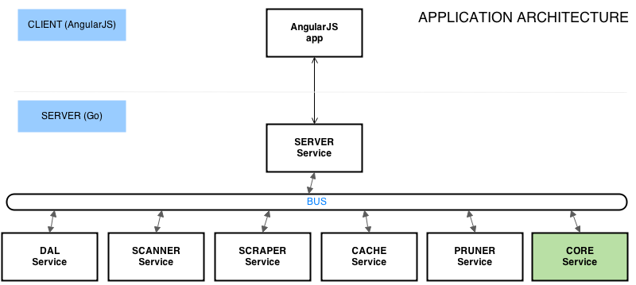
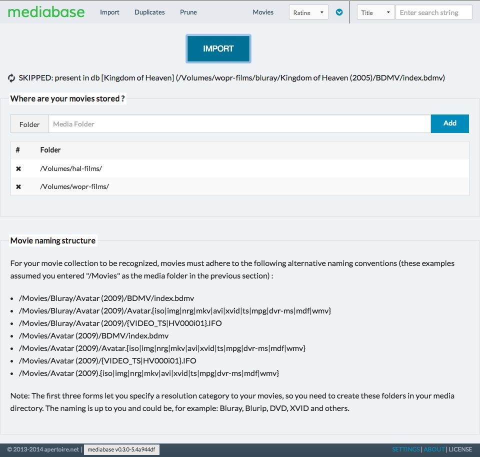

**tl;dr** This article discusses an implementation of the actor paradigm in a go application.

## Background

Currently, there are two well known languages that support actors: [Erlang](https://www.erlang.org) and [Scala](https://www.scala-lang.org).

The core concept is that modules (actors) in your application communicate exchanging messages, which makes concurrency very easy to handle for developers.

This is in contrast to thread-based concurrency (like in C++), where the developer has much more work to do to get the system working correctly.

## Mediabase


I will use the Mediabase application (check my [previous article](/introducing-mediabase/)) to showcase the proposed architecture.

Very shortly, Mediabase is a proof-of-concept application to catalogue a media library consisting of movies. It scans the folders you choose looking for movies, then fetches metadata from [themoviedb.org](https://www.themoviedb.org) and [The OMDB API](https://www.omdbapi.com) and presents the information in a nice web page.

You can get the code [here](https://github.com/apertoire/mediabase).

## Architecture

Let's take a look at a high-level view of the code structure:



What we have here are very loosely coupled services (actors), interacting with each other by means of a system wide bus (message exchange).

Each service carries a single responsibility, with the exception of the _Core_ service, which is kind of a manager, as it coordinates work between services.

Let's see what each service does

- _Server_: It runs the web server and communicates with the front end via a chosen protocol. In this case it's a rest api, but could also be websockets
- _DAL_: It's in charge of the database, all db requests have to go through here
- _Scanner_: It scans the folder chosen by the user, looking for media to be collected (via regular expressions).
- _Scraper_: Hits the TMDB and OMDB apis to gather metadata for the movies found by the Scanner service.
- _Cache_: Once metadata is received, it downloads movie art (cover, backdrop, etc) and stores it in a local folder
- _Pruner_: Removes database media entries that are no longer present in the physical folders
- _Core_: It's an orchestrator, directing other services to do it's bidding.

## Implementation

So how is all of this implemented ?

### Basic structure

Let's start with the _Bus_. ([source](https://github.com/apertoire/mediabase/blob/master/server/bus/bus.go))

```go
type Bus struct {
...
ImportMovies chan *message.Status
ImportMoviesStatus chan *message.Status

    ScanMovies  chan *message.ScanMovies
    ScrapeMovie chan *message.Movie

    MovieFound     chan *message.Movie
    MovieScraped   chan *message.Media
    MovieRescraped chan *message.Media

    ImportMoviesFinished chan int
    ...

}
```

The _Bus_ struct holds the channels that are used by the services to communicate. Different types of messages are defined, based on which functionality is needed.

Let's check how services are built. ([source](https://github.com/apertoire/mediabase/blob/master/server/services/scanner.go))

```go
type Scanner struct {
Bus *bus.Bus
Config *model.Config

    re           []*helper.Rexp
    includedMask string

}

func (self \*Scanner) Start() {
mlog.Info("starting scanner service ...")
mlog.Info("compiling regular expressions ...")

    self.re = make([]*helper.Rexp, 0)

    for _, regex := range self.Config.MediaRegexs {
    	self.re = append(self.re, &helper.Rexp{Exp: regexp.MustCompile(regex)})
    }

    self.includedMask = ".bdmv|.iso|.img|.nrg|.mkv|.avi|.xvid|.ts|.mpg|.dvr-ms|.mdf|.wmv|.ifo"

    go self.react()

    mlog.Info("scanner service started")

}

func (self \*Scanner) Stop() {
mlog.Info("scanner service stopped")
}

func (self \*Scanner) react() {
for {
select {
case msg := <-self.Bus.ScanMovies:
go self.doScanMovies(msg.Reply)
}
}
}
```

Each service holds a reference to the _Bus_, which is injected at creation time (we'll see that later).

- The Start function does any required initialization, but most importantly it triggers a listening loop: the react function.
- The Stop function does any cleanup that may be needed.
- The react function uses a classic Go construct: a for/select loop.

The react function is the heart of the service: it sits there waiting for a message to arrive in order to dispatch some work.

### Process walkthrough

Let's track how the import process moves along, so we get a better idea on how the services interact.

It begins with _Server_ receiving an API request to import movies, which makes it run the importMovies function. ([source](https://github.com/apertoire/mediabase/blob/master/server/services/server.go#L127))

```bash
func (self *Server) importMovies(c *gin.Context) {
msg := message.Status{Reply: make(chan \*message.Context)}
self.Bus.ImportMovies <- &msg
reply := <-msg.Reply

    c.JSON(200, &reply)

}
```

It creates an ImportMovies message with a reply channel on which it sits waiting. Once the response is received, it sends it back to the front end.

_Core_ is listening for a message on the ImportMovies channel. ([source](https://github.com/apertoire/mediabase/blob/master/server/services/core.go#L55))

```bash
func (self \*Core) react() {
for {
select {
...
case msg := <-self.Bus.ImportMovies:
go self.doImportMovies(msg)

    	case msg := <-self.Bus.ImportMoviesStatus:
    		go self.doImportMoviesStatus(msg)

    	case msg := <-self.Bus.MovieFound:
    		go self.doMovieFound(msg)

    	case msg := <-self.Bus.MovieScraped:
    		go self.doMovieScraped(msg)

    	case msg := <-self.Bus.ImportMoviesFinished:
    		go self.doImportMoviesFinished(msg)
    	}
    }

}
```

It runs a finite state machine to control the flow of execution, but it basically does: ([source](https://github.com/apertoire/mediabase/blob/master/server/services/core.go#L110))

```bash
func (self *Core) importer(e *fsm.Event) {
if e.Src == "idle" {
msg := message.ScanMovies{Reply: make(chan string)}
self.Bus.ScanMovies <- &msg
reply := <-msg.Reply

    	self.context.Message = reply
    }

    status, _ := e.Args[0].(*message.Status)
    status.Reply <- &self.context

}
```

It sends a ScanMovies message and waits for a reply. When the reply is received, it is sent back to the original requestor (_Server_).

The _Scanner_ service is listening for the ScanMovies message. ([source](https://github.com/apertoire/mediabase/blob/master/server/services/scanner.go#L76))

```bash
func (self \*Scanner) doScanMovies(reply chan string) {
reply <- "Movie scannning process started ..."

    for _, folder := range self.Config.MediaFolders {
    	err := self.walker(folder)
    	if err != nil {
    		mlog.Info("Unable to scan movies: %s", err)
    	}

    	mlog.Info("Completed scan of folder: %s", folder)
    }

    self.Bus.ImportMoviesFinished <- 1

}
```

The first thing it does is reply indicating that the import process has started. This message will go all the way back to the front end.

It then starts walking through the media folders looking for movies.

Whenever new media is found, a MovieFound message is delivered on the _Bus_. ([source](https://github.com/apertoire/mediabase/blob/master/server/services/scanner.go#L131))

```bash
...
movie := &message.Movie{Title: rmap["Name"],
File_Title: rmap["Name"],
Year: rmap["Year"],
Resolution: resolution,
FileType: rmap["FileType"],
Location: path}

    mlog.Info("FOUND [%s] (%s)", movie.Title, movie.Location)

    self.Bus.MovieFound <- movie

...
```

_Core_ listens for the MovieFound message. ([source](https://github.com/apertoire/mediabase/blob/master/server/services/core.go#L131))

```bash
func (self *Core) doMovieFound(movie *message.Movie) {
c := make(chan bool)

    self.Bus.CheckMovie <- &message.CheckMovie{Movie: movie, Result: c}
    exists := <-c

    var text string
    if exists {
    	text = fmt.Sprintf("SKIPPED: present in db [%s] (%s)", movie.Title, movie.Location)
    	mlog.Info(text)
    } else {
    	text = fmt.Sprintf("FOUND: [%s] (%s)", movie.Title, movie.Location)
    	self.Bus.ScrapeMovie <- movie
    }

    self.fsm.Event("found", text)

}
```

It first checks that the movie is not present in the database (by sending a CheckMovie message which is answered by the _DAL_ service). If it's not in the db, it then sends a ScrapeMovie request.

The _Scraper_ service is waiting for this message: ([source](https://github.com/apertoire/mediabase/blob/master/server/services/scraper.go#L89))

```bash
func (self *Scraper) requestWork(movie *message.Movie) {
mlog.Info("WORK REQUESTED [%s]", movie.Title)

    c := make(chan *message.Media)

    gig := &Gig{
    	self.Bus,
    	self.tmdb,
    	&message.Media{BaseUrl: "", SecureBaseUrl: "", BasePath: "", Movie: movie, Forced: false},
    	c,
    }

    self.workpool.PostWork("gig", gig)

    media := <-c

    self.Bus.MovieScraped <- media

    mlog.Info("WORK COMPLETED [%s]", movie.Title)

}
```

_Scraper_ has a workpool of workers that parallelize the download of metadata from TMDB and OMDB. It starts a worker (self.workpool.PostWork) sending it a channel to reply to when it's done.

When the worker is done, _Scraper_ delivers a MovieScraped message on the bus, which is expected by _Core_. ([source](https://github.com/apertoire/mediabase/blob/master/server/services/core.go#L157))

```go
func (self *Core) doMovieScraped(media *message.Media) {
go func() {
mlog.Info("STORING MOVIE [%s]", media.Movie.Title)
self.Bus.StoreMovie <- media.Movie
}()

    go func() {
    	mlog.Info("CACHING MEDIA [%s]", media.Movie.Title)
    	media.BasePath = self.Config.DataDir
    	self.Bus.CacheMedia <- media

    	self.fsm.Event("scrape", media.Movie)
    }()

}
```

_Core_ starts two goroutines to trigger two parallel messages:

- StoreMovie: so that the movie is stored in the database (this is done by the _DAL_ service)
- CacheMedia: so that the movie art (cover, backdrop) is downloaded and stored in a local folder (this is done by the _Cache_ service)

The front end has previously received an initial reply to the import movies API request and displayed it to the user.

It then does long-polling on the server, to get a progress report. The ImportMovieStatus message is senty by _Server_ and answered by _Core_: ([source](https://github.com/apertoire/mediabase/blob/master/server/services/core.go#L127))

```go
func (self *Core) doImportMoviesStatus(status *message.Status) {
status.Reply <- &self.context
}
```

<br>

It simply sends back the current status of importing, since each message activity received by _Core_ is written to the context variable.



## Conclusion

Let's wrap it up with the beginning.

The whole system is started by some bootstrap code ([source](https://github.com/apertoire/mediabase/blob/master/server/boot.go))

```bash
func main() {
config := model.Config{}
config.Init(Version)

    bus := bus.Bus{}
    dal := services.Dal{Bus: &bus, Config: &config}
    server := services.Server{Bus: &bus, Config: &config}
    scanner := services.Scanner{Bus: &bus, Config: &config}
    scraper := services.Scraper{Bus: &bus, Config: &config}
    pruner := services.Pruner{Bus: &bus, Config: &config}
    cache := services.Cache{Bus: &bus, Config: &config}

    list := []services.Service{&dal, &scanner, &scraper, &pruner, &cache}
    core := services.Core{Bus: &bus, Config: &config, Services: list}

    bus.Start()
    dal.Start()
    server.Start()
    scanner.Start()
    scraper.Start()
    pruner.Start()
    cache.Start()
    core.Start()

    mlog.Info("press enter to stop ...")
    var input string
    fmt.Scanln(&input)

    core.Stop()
    cache.Stop()
    pruner.Stop()
    scraper.Stop()
    scanner.Stop()
    server.Stop()
    dal.Stop()

}
```

Each service is created and injected with _Bus_ and _Config_. Then each one of them is started, system waits on an input and it is then stopped.

## Alternatives

There are a couple of alternatives I can think of:

- Make each channel buffered and don't start a goroutine when responding to messages, so that only one activity is running on a service at any given time.
- Rather than a central bus, use a pubsub architecture to dispatch messages. I'm looking into this for another application I'm building, but it has the drawback that you lose static type checking, as I defined the messaging payload to be interface{}.

## Epilogue

Hope you found the article interesting.

Please leave your comments here, share on social media or go to the [Github page](https://github.com/apertoire/).

**Image Source [misucell](http://www.misucell.com/WDF-273693.html)**
