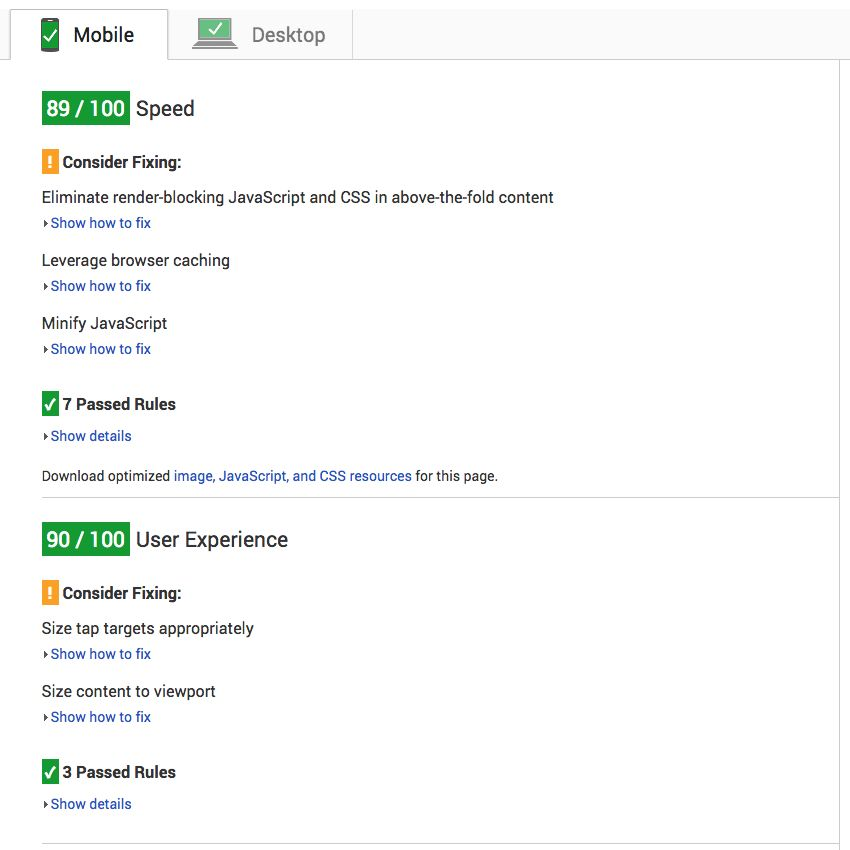
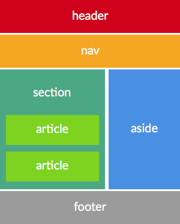
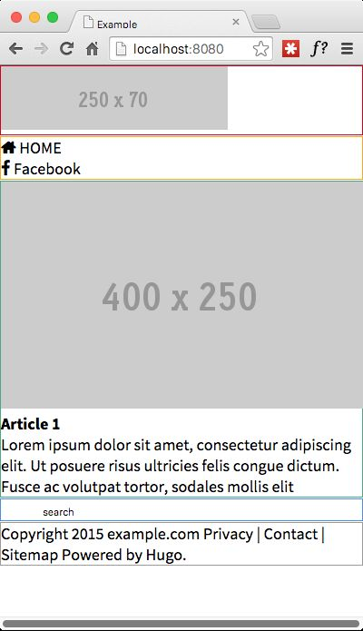
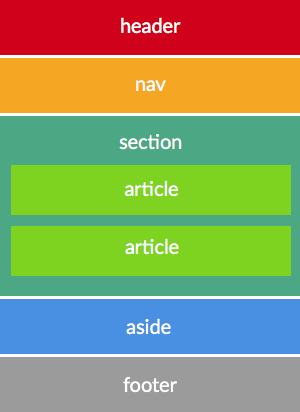
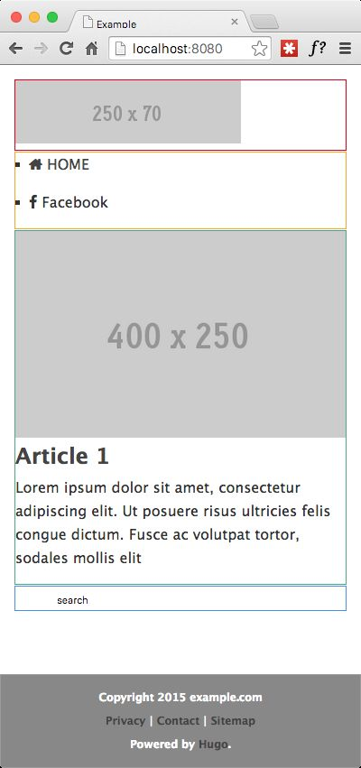
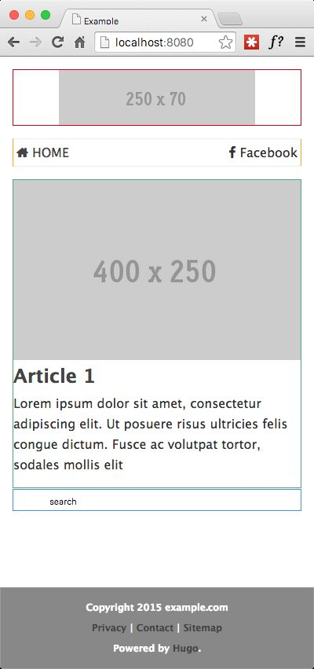
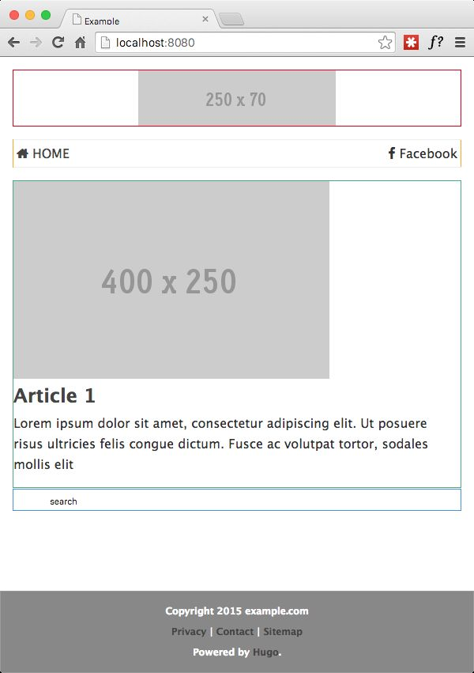
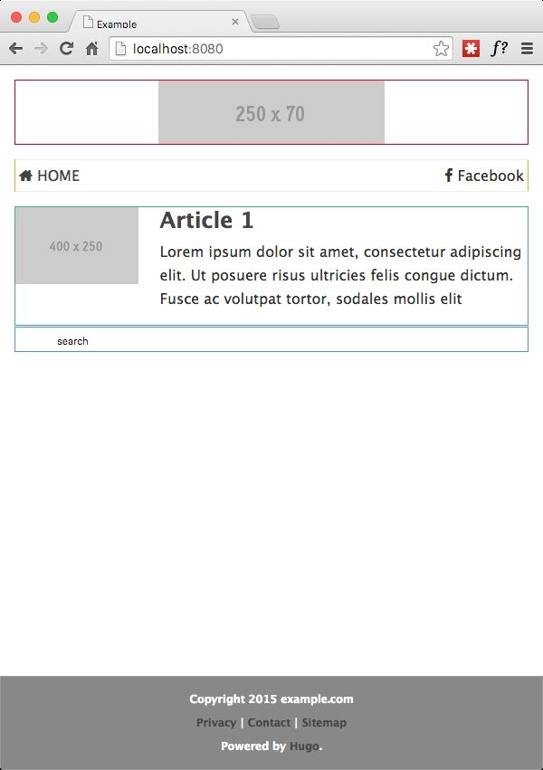
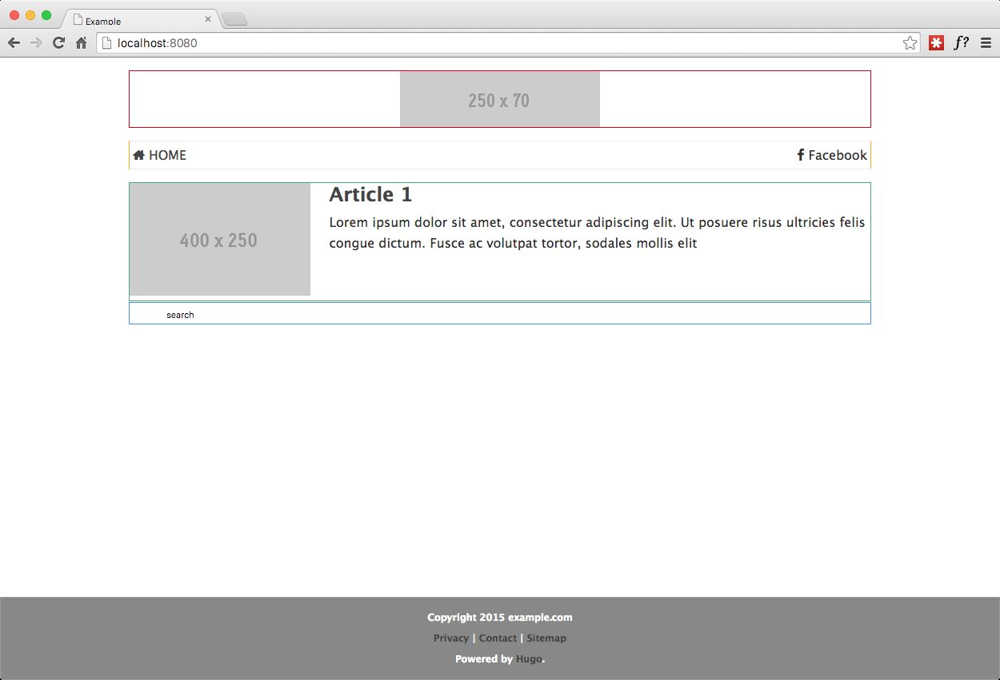

**tl;dr** Designing mobile-friendly websites is a must these days.
In addition to the increasing traffic coming from mobile devices, Google will make [some changes](https://googlewebmastercentral.blogspot.com/2015/02/finding-more-mobile-friendly-search.html) to its algorithm to improve the discovery of mobile-friendly content.

In this article, the first of a [two part series](/mobile-friendly-website-2/), I'll show you how to build a responsive blog website, using CSS3's _display: flex_ and _media queries_ as the main construction blocks.

## Introduction

Creating a responsive web design seems a daunting task at first, but with the right mindset, it can be done pretty quickly.

If there's only one take away from this article, it would be to make your design _Mobile First_. Only after it looks ok on small screens, should you add upon it for bigger ones.

My previous site (www.apertoire.net) was built to be Desktop first, and it was not a pretty sight when viewed on a smartphone (lots of horizontal scrolling, no margins, images displaying their full width, etc.).

All in all, a terrible UX, so I needed to take action.

The goals of this project are the following:

1. Build the foundation for a mobile-friendly website and make it as lean as possible
2. Use modern tooling for an efficient build process
3. Get passing scores on [Google's PageSpeed Insight](https://developers.google.com/speed/pagespeed/insights/)

We'll focus on goal #1 in this article. In Part 2, we'll cover goals #2 and #3.

But I'll cheat a little by showing the results for goal #3 now. These are my current PageSpeed scores:



I got a 95/100 score on Desktop.

## The Skeleton

The first decision is the layout. I settled on this:



There's a "hidden" container div that holds header, nav, section and aside, in order to manage these elements as a single unit and center them. We'll see that later.

The footer will occupy the whole width of the browser screen and the articles section and aside will share space proportionally, side by side.

Starting with [HTML5 Boilerplate](https://html5boilerplate.com) as the base, the initial version is this ([source files](https://github.com/jbrodriguez/mobile-article/tree/master/v1)):

```html
<!doctype html>
<html class="no-js" lang="en-us">
  <head>
    <meta charset="utf-8" />
    <meta http-equiv="x-ua-compatible" content="ie=edge" />

    <title>Example</title>

    <link rel="apple-touch-icon" href="/apple-touch-icon.png" />
    <!-- Place favicon.ico in the root directory -->

    <link rel="stylesheet" href="style.css" />
    <link rel="stylesheet" href="//maxcdn.bootstrapcdn.com/font-awesome/4.3.0/css/font-awesome.min.css" />
    <link rel="canonical" href="https://example.com/" />

    <meta name="description" content="My website description" />
    <meta name="viewport" content="width=device-width, initial-scale=1" />
  </head>
  <body>
    <div class="container">
      <header>
        <a href="/" class="logo"></a>
        <div class="adtop" style="background-color: #eee"></div>
      </header>
      <nav>
        <ul>
          <li>
            <a href="/"><i class="fa fa-home"></i> HOME</a>
          </li>
        </ul>
        <ul>
          <li><i class="fa fa-facebook"></i> Facebook</li>
        </ul>
      </nav>
      <div class="main">
        <section class="content">
          <article class="home">
            <section class="image">
              
            </section>
            <section class="titles">
              <h2>
                <a href="/article1">Article 1</a>
              </h2>
              <p>
                Lorem ipsum dolor sit amet, consectetur adipiscing elit. Ut posuere risus ultricies felis congue dictum.
                Fusce ac volutpat tortor, sodales mollis elit
              </p>
            </section>
          </article>
        </section>

        <aside>
          <input type="text" value="search" />
          <section class="adnav">
            <div class="adnav" style="background-color: #eee"></div>
          </section>
        </aside>
      </div>
    </div>

    <footer>
      <section>
        <span>Copyright 2015 example.com</span>
        <span>
          <a href="/privacy">Privacy</a> | <a href="/contact">Contact</a> |
          <a href="/sitemap.xml">Sitemap</a>
        </span>
        <span>Powered by <a href="https://gohugo.io">Hugo</a>.</span>
      </section>
    </footer>

    <script src="script.js" type="text/javascript"></script>
    <!-- Google Analytics: change UA-XXXXX-X to be your site's ID. -->
    <script>
      (function (b, o, i, l, e, r) {
        b.GoogleAnalyticsObject = l;
        b[l] ||
          (b[l] = function () {
            (b[l].q = b[l].q || []).push(arguments);
          });
        b[l].l = +new Date();
        e = o.createElement(i);
        r = o.getElementsByTagName(i)[0];
        e.src = '//www.google-analytics.com/analytics.js';
        r.parentNode.insertBefore(e, r);
      })(window, document, 'script', 'ga');
      ga('create', 'UA-XXXXX-X', 'auto');
      ga('send', 'pageview');
    </script>
  </body>
</html>
```

Believe it or not, we're 50% done. This was the hardest part of it all.

The html boilerplate comes with normalization css (it resets the style of various elements).

I replaced it with a slightly modified version of [this template](https://jaydenseric.com/blog/forget-normalize-or-resets-lay-your-own-css-foundation).

With the normalization css in place and a border around each section to match the layout colors from the previous image, this is how it looks:



We can simulate a small screen size by resizing the browser to its minimum width. However, a more precise and thorough option is available using [Device mode](https://developer.chrome.com/devtools/docs/device-mode) in Google Chrome.

The page definitely doesn't look like much, but it _DOES_ have all the basic markup we need.

The horizontal scrolling here is an artifact caused by the colored borders, but there certainly would be one if the image was wider, which is not good.

## Applying first styles

The [CSS3 Flexbox model](https://css-tricks.com/snippets/css/a-guide-to-flexbox/) is available [today](https://caniuse.com/#search=flex) in all major browsers and platforms. So, why not use it as the grid framework ?

Eventually, CSS Grid Layout will be the way to go, but [it's not ready yet](https://caniuse.com/#search=grid).

There are 3 important things to consider when building a responsive layout:

1. Fluid Layout
2. Responsive Images
3. Fonts

For the first item, the basic idea is that by default, we will display each layout section stacked on top of each other (**flex-direction: column**) and move them side by side (the articles and aside sections) as the screen width increases (landscape instead of portrait, tablet instead of smartphone or desktop instead of tablet, etc.), by switching to **flex-direction: row**.

This means that the starting layout (mobile first), looks like this conceptually:



To get responsive images, we will apply **width: 100%** to the img tag. No srcset attribute or picture element for the moment.

With regard to fonts, we declare font-size as 100% and work in _ems_ from there on.

We want a sticky footer (the footer has to remain pinned to the bottom, regardless of the height of the content above it), so we declare the container element to use all the available viewport height (**flex: 1**), pushing the footer to the bottom edge.

We also adjust the components of the footer to appear stacked and centered in the page.

So this gives us this basic CSS (with some basic headers, paragraphs, ul and a styling ommitted; [complete source](https://github.com/jbrodriguez/mobile-article/tree/master/v2)):

```css
body {
  font:
    100%/1.625em 'Lucida Sans Unicode',
    'Lucida Grande',
    sans-serif;
  color: #333;
  display: flex;
  flex-direction: column;
  justify-content: center;
  align-items: stretch;

  min-height: 100vh;
}

img {
  max-width: 100%;
  height: auto;
  border: 0;
}

.container {
  padding: 1em;
  padding-bottom: 0;

  display: flex;
  flex-direction: column;
  justify-content: flex-start;
  align-items: stretch;

  flex: 1;
}

footer {
  color: white;
  background-color: #888;

  font-size: 0.75em;
  font-weight: 700;

  display: flex;
  flex-direction: column;
  justify-content: flex-start;
  align-items: stretch;
}

footer section {
  padding: 1em;

  display: flex;
  flex-direction: column;
  justify-content: center;
  align-items: center;
}
```

By touching the properties of these 5 elements, we get this:



We're almost 75% done with this project !

We have responsive text, responsive images and a sticky footer 100% wide with centered sections. If you leave the page as is and add articles, it will already look pretty good on a mobile device.

Notice that there's no horizontal scrolling, even if the image is now larger than the space where it's contained. This is good.

So, what's missing/not working so well?

- The logo at the top isn't centered
- The Home and Facebook anchors should be at the opposite ends of the page, rather on top of each other
- For wider screens (simulated by resizing the browser), the article title and description should "float" to the right side of the image
- For wider screens, the content area remains pinned to the left, rather than getting centered

## Beware: No floating allowed

Let's address the first two issues, without touching our html code at all.

We define the header section to be **flex** and to center its contents. Unbelieveably easy. This centers the logo both vertically and horizontally.

As for the menu (nav element), we declare it to have a horizontal orientation (**flex-direction: row**) and to push its child elements to each end of its box (**justify-content: space-between**).

No floating right or left, no clear fix, no display: table, no content: "" required.

This is _AWESOME_ !

The added CSS ([sources](https://github.com/jbrodriguez/mobile-article/tree/master/v3)):

```css
header {
  margin-bottom: 1em;
  display: flex;
  flex-direction: column;
  justify-content: stretch;
  align-items: center;
}

header a {
  display: flex;
}

nav {
  border-top: 1px solid #eee;
  border-bottom: 1px solid #eee;
  margin-bottom: 1em;

  display: flex;
  flex-direction: row;
  justify-content: space-between;
  align-items: stretch;
}

nav ul {
  display: flex;
  margin: 0;
  padding: 0;
}

nav ul li {
  list-style: none;
  padding: 0.25em;
}

.main {
  display: flex;
  flex-direction: column;
  justify-content: flex-start;
  align-items: stretch;
}
```

The Result



## Querying the media

We're done.

No, wait ! We still have to resolve the last two issues we previously identified:

- At larger viewports, the article title and description should "float" to the right side of the image
- As the viewport widens (simulated by resizing the browser), the content area remains pinned to the left, rather than getting centered

This is where media queries come into play and shine their own bright light.

Media Queries allow you to define a set of rules to be applied when the screen (viewport) is sized past a certain threshold. There are several variations on how to achieve this, so you should read the base material to understand them all.

But in the context of this project, the solution is remarkably simple.

To solve the first issue, since we defined our layout to display properly at the minimum size viewports (which start at 320px for smartphones), all we need to do now is to apply style changes when the viewport is wide enough to accommodate us.

This is the page at 600px wide



We already know how to "float" two sections side by side with flexbox, we simply declare **flex-direction: row**.

Additionally, in this case, we will set both sections to grow proportionally with their parent's container (the image gets 1/3 and the title+description gets 2/3 of the space).

This is the CSS required to achieve this ([sources](https://github.com/jbrodriguez/mobile-article/tree/master/v4)):

```css
@media screen and (min-width: 600px) {
  .home {
    display: flex;
    flex-direction: row;
    justify-content: flex-start;
    align-items: stretch;
  }

  .home .image {
    flex: 1;
    margin-right: 1.5em;
  }

  .home .titles {
    flex: 3;
  }
}
```

and the results are in:



Wasn't that beautiful? Also check out how the footer stays pinned at the bottom, as desired.

As for the other issue, we will do two things. We'll add a "wrapper" div around the container, with horizontal orientation and centered.

Additionally, we set a max width on the container, so that the content is easily readable on wide screens.

HTML changes ([sources](https://github.com/jbrodriguez/mobile-article/tree/master/v5)):

```html
<body>
  <div class="wrapper">
    <div class="container">....</div>
  </div>
  <footer>...</footer>
</body>
```

CSS changes ([sources](https://github.com/jbrodriguez/mobile-article/tree/master/v5)):

```css
.wrapper {
display: flex;
flex-direction: row;
justify-content: center;
align-items: stretch;

    flex: 1;

}

.container {
max-width: 960px;
...
}
```

This is the page at 1250px wide



For the final touch, we need to "float" the aside element, to obtain the layout we set out to get.

We'll make that switch at 850px and we'll assign 3/4 to the .main container and 1/4 of the space to the aside element ([sources](https://github.com/jbrodriguez/mobile-article/tree/master/v6)).

```css
@media screen and (min-width: 850px) {
  .main {
    flex-direction: row;
  }

  .main .content {
    flex: 4;
    margin-right: 1.5em;
  }

  .main aside {
    flex: 1;
  }
}
```

Take a look at the final result:


## Next Steps

What's left now, is mostly choosing a color theme and applying it to the site.

This blog is the result of such process, so you have been seeing the results as you have been reading the article.

## Conclusion

We have built a very solid foundation for a responsive website, without the need of either:

- CSS frameworks (Bootstrap, Foundation, etc.)<br>
  These frameworks add quite a lot of size to any page

- Blogging platforms (Wordpress)<br>
  Wordpress is heavy both in terms of processing resources during web browsing as well as page size (due to themes, plugins, etc.)

Still, there's room for improvement, make it even better, and by better I mean faster, specially for network traffic sensitive mobile devices.

In [Part 2](/mobile-friendly-website-2/), I'll go over Responsive AdSense ads, static blog generators and an automated build process that publishes the blog with a single command, while performing a sequence of optimizations.

## Share

If you found this article interesting, wouldn't you mind sharing it on social media via the links below ?

Also, feel free to ask any questions or give your input in the comments section.

Thanks in advance !

**Image Source [Marc Samsom](http://www.flickr.com/photos/10053524@N07/4020310552/in/photolist-78g9gb-7abm7S-7cVFcW-7cVQ7J-7iHV9F-7iHVu4-cp74HC-cp6VHG-cp71P3-cp6Xxo-cp6Ym1-cp6WtA-cp6V4u-cp6TRf-cp6Z9q-7ETbun-9QXr3R-7PwK7j-9fcakZ-7Q7GP9-eDX9m7-eDX9kQ-c8tD8o-bZZvv5-7EX3qU-98VEVo-csFfKd-bCY5zU-bRSRHa-8tPdsq-89icCP-b4JNGT-bRSRxD-bRSQCF-bRSRui-bRSRkZ-bCY5t9-bCY6Mb-bRSNgH-bRSPuP-bCY52b-bCY7uE-bRSLAn-bRSRXg-bCY8NA-bCY8zJ-bRSMfe-bRSSdp-bRSS8x-bCY6x9-bCY8DW)**
