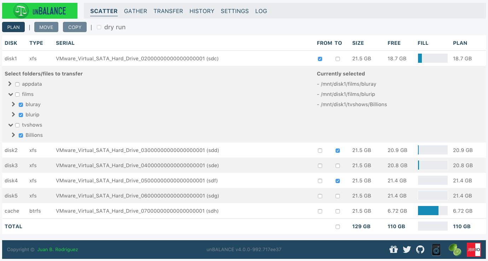

# the beginnings

[unbalanced](https://github.com/jbrodriguez/unbalance) is one of my favorite open source projects.

It used to look like this:

This was my first app to be exposed to a wide general audience and it's still going strong.

I started developing it in 2014, as a consequence of using [Unraid](https://unraid.net/) as my NAS.

I needed a way to move files around, and the only way to do it was via the command line.

I wanted something more visual and with more "intelligence", so I created a web app that allowed me to do that.

# unraid

I've been using Unraid for even longer than that. I purchased my first license in 2010, when I discovered its capabilities.

Unraid is a local storage solution.

It allows you to set up a server with a bunch of disks, and it provides a web interface to manage it.

I had toyed with [Solaris and ZFS before](https://jbrio.net/posts/oh-solaris-mio/), but I didn't like the idea of having to buy all the drives at once (because of vdevs, i think this has changed or will change).

Unraid, on the other hand, allows you to add different sized drives as needed, over time.

Why would you need local storage, in these days of cloud computing, streaming, and all that?

Well, you don't really own the media when you're subscribed to some provider, you're just renting it.

For instance, if you

- watch movies on Netflix, you don't own them and Netflix can and has removed them all the time
- listen to music on Spotify, you don't own it and they can and do remove it all the time
- and so on ...

With Unraid, you own your media, and you can access it whenever you want.

Also, accidents may happen.

Look at [what happened with Google Drive](https://mashable.com/article/google-drive-users-report-files-disappeared) recently or the data breaches on Apple iCloud in the past.

It always important to have redundant copies of your data, and Unraid is a great way to do that.

There's a lot of information about Unraid out there, in addition to the main site, I suggest you look at the [blog](https://unraid.net/blog), the [forums](https://forums.unraid.net/) and the [Spaceinvader One YouTube channel](https://www.youtube.com/results?search_query=spaceinvader+one).

# the essence

At its core, unbalanced is a graphical user interface on top of rsync.

It asks the user for some parameters, applies some algorithms to calculate disk allocations, then it builds an rsync command for execution.

It monitors the rsync process, in order to show the overall progress to the user.

This last part is really unique, I haven't seen any other tool that does this the way unbalanced does.

# the anniversary

I wrote the app in 2014 and didn't make any big conceptual changes since then.

It was the first app I wrote in [Go](https://golang.org/) and [React](https://reactjs.org/), so it was a bit rough around the edges, especially in terms of the UX (user experience).

It's also true that I built it for my specific needs, it did what I needed, although it showed some quirks for other users 😀.

Approaching its 10th anniversary, I finally had some time to work on it, so I decided to rewrite the UI from scratch, using modern best practices (I'll write a separate technical post about this).

I'm really proud of how it turned out, it's a lot more polished, a lot more usable and a lot more beautiful (dark theme 🙌!).

# the plugs

Winding down the post, I'll plug a few things:

- [Unraid](https://unraid.net/): if you don't use it yet, consider doing it
- [unbalanced](https://github.com/jbrodriguez/unbalanced): if you need to move data around in Unraid, give it a try (also consider [sponsoring](https://jbrio.net/unbalanced) it)
- [ControlR](https://www.apertoire.com/controlr/): if you use Unraid, consider purchasing this mobile app, which provides you an easy interface to manage your server

# the end

Thanks for reading a bit of history about one of my favorite apps !
