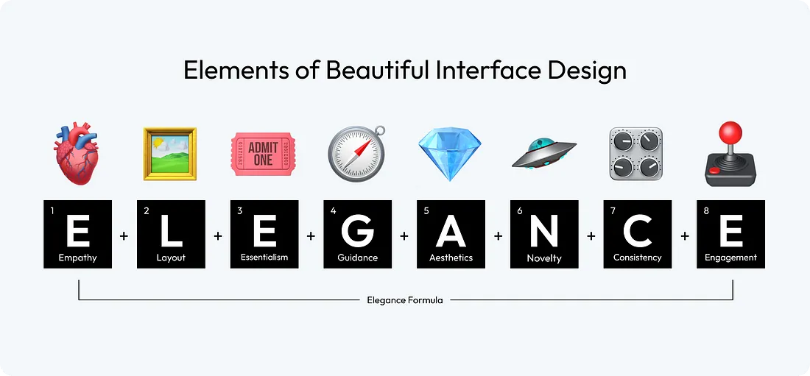
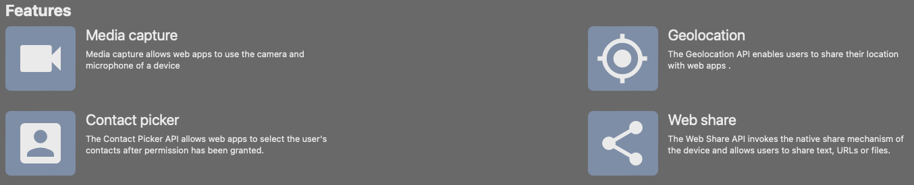
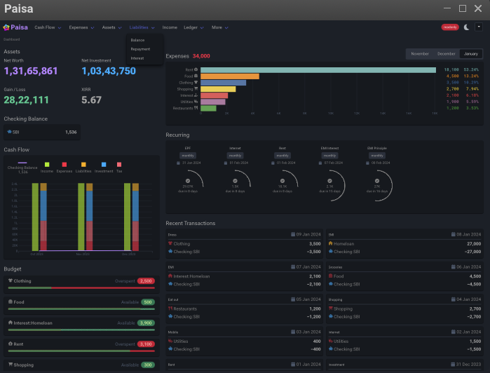
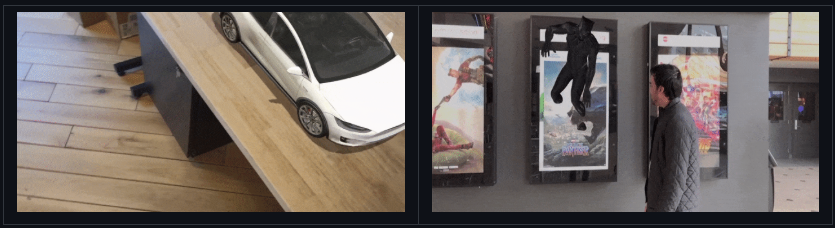

[58 rules for beautiful UI design](https://uxdesign.cc/58-rules-for-stunning-and-effective-user-interface-design-ea4b93f931f6) -
"... The right UI can elevate an application from functional to unforgettable, making the difference between a user who engages once and one who returns time and again. ..."

[What PWA Can Do Today](https://whatpwacando.today/) -
"... A showcase of what is possible with Progressive Web Apps today. ..."

[Paisa](https://paisa.fyi/) - built with [Svelte](https://svelte.dev/) and [Go](https://go.dev/), using [ledger](https://ledger-cli.org/), a doubl-entry accounting system, looks interesting

[From slow to SIMD: A Go optimization story](https://sourcegraph.com/blog/slow-to-simd) - "... So, there's this function. It's called a lot. More importantly, all those calls are on the critical path of a key user interaction. Let's talk about making it fast. ..."

[mlx-rag:](https://github.com/vegaluisjose/mlx-rag/tree/main) - "... A simple and fast way to create a responsive dashboard with React and Material-UI. ..."

[viro](https://github.com/NativeVision/viro) - "... : ViroReact: The AR and VR library for React Native ..."

