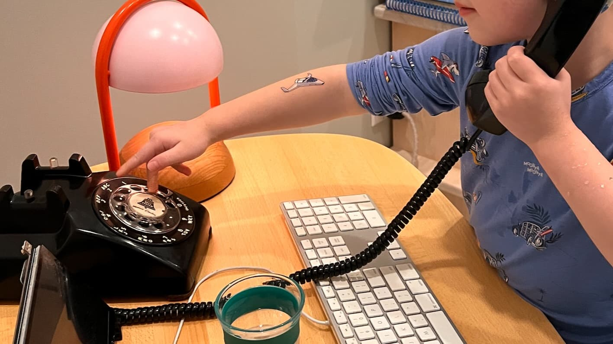

[Where and When to See the 2024 Total Solar Eclipse](https://mossandfog.com/where-and-when-to-see-the-2024-total-solar-eclipse/)

> this one is just around the corner, be prepared !

[mnutt/rotary](https://github.com/mnutt/rotary) - "... Adventures with rotary phones and asterisk ..."

[Llama Hub](https://llamahub.ai/?tab=tools) - "... Mix and match our Data Loaders and Agent Tools to build custom RAG apps or use our LlamaPacks as a starting point for your retrieval use cases. ..."

[Navidrome](https://www.navidrome.org/) - "... Your Personal Streaming Service ..."

[Inclusive Sans — Olivia King](https://www.oliviaking.com/inclusive-sans?ref=sidebar) - "... Inclusive Sans is a text font designed for accessibility and readability ..."

[Robin's blog – Friends don't let friends export to CSV](https://kaveland.no/friends-dont-let-friends-export-to-csv.html) - "... One of the least enjoyable experiences from that time was to deal with big CSV exports ..."

[oldmoe/litestack](https://github.com/oldmoe/litestack) - "... Litestack is a Ruby gem that provides both Ruby and Ruby on Rails applications an all-in-one solution for web application data infrastructure ..."

[Dioxus | An elegant GUI library for Rust](https://dioxuslabs.com/) - "... ### Dioxus is a Rust library for building apps that run on desktop, web, mobile, and more. ..."

[Moving to local-first state management with GraphQL · Plain](https://www.plain.com/blog/moving-to-local-first-state-management) - "... one feature that may have gone unnoticed was a fundamental shift in how we do state management on the front-end ..."

[developersdigest/llm-answer-engine](https://github.com/developersdigest/llm-answer-engine?tab=readme-ov-file) - "... Build a Perplexity-Inspired Answer Engine Using Next.js, Groq, Mixtral, Langchain, OpenAI, Brave & Serper ..."

[martiliones/icon-set-creator](https://github.com/martiliones/icon-set-creator) - "... CLI for creating React Native app icons ..."

[myshell-ai/OpenVoice](https://github.com/myshell-ai/OpenVoice?tab=readme-ov-file) - "... Instant voice cloning by MyShell ..."

> this is downright scary 😱
